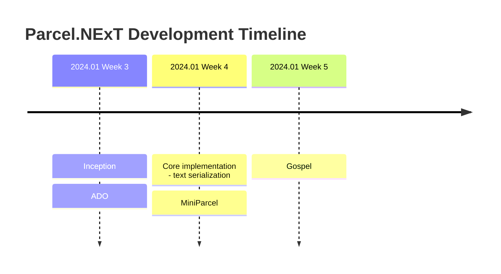
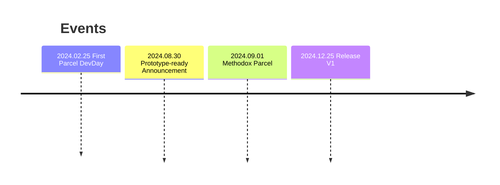

# Parcel (V7) - The Workflow Engine

<!-- This is for the website, it's now deprecated, and we should migrate/replace contents with Methodox.io, and manage it in dedicated repo; See MethodoxLandingPageReactWebApp for current official website -->
<!-- This is the entry point of public facing Github Pages -->

Welcome to Parcel!
Github: https://github.com/Charles-Zhang-Parcel

<!-- Consider removing the first timeline - move to personal note; The second timeline can be kept -->

