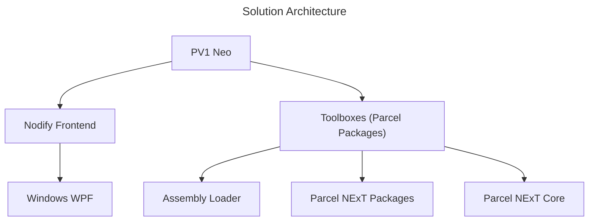

# PV1 Neo

**Version**: PV1 Neo v0.1.0  
**Last Update**: 2024-06-20  
**Status**: Active Development  
**POS Compliancy (Estimate)**: 60%

<!--There are two ways of making PV1 Neo POS-Compliant: Base entire runtime directly on Parcel NExT; Provides dedicated PackageLoader to allow consumption of Parcel NExT packages. The latter can be considered a small step towards eventual "rebasing".-->

Windows-only front-end for Parcel NExT, a visual programming platform. This implementation is targets lightweight usage, beta tests, and covers only subset of POS features. It's node-only Windows-only and doesn't support advanced graph-native constructs. It would suffice for the purpose of concept development, testing libraries and showcasing the core software aspects of Parcel workflows. This setup also directly embeds the Ama runtime, and (at least in beta tests) make direct reference/dependency on available toolboxes (packages).

PV1 is implemented using WPF, it uses single-process model (contrast to server-client model) and the graph editor is not as flexible as Gospel, so it may not support full sets of (front-end) capabilities of Gospel. Despite that, we try as much as possible to be full POS-compliant<!--and it's also important for POS to clarify which parts are formal standards and which parts are just front-end features-->. Below table summarizes main capabilities of PV1 when compared to other front-ends.

## Setup

All key components are implemented inside `Parcel.Neo.Base` assembly, the front end is implemented in `Parcel.Neo`, and all functional components are implemented in various **Toolboxes** (will soon be completely replaced by Parcel packages).

1. Simply open `.sln` solution
2. Run `Parcel.Neo` project

Download pre-built binaries for Windows at: [Github Release Page](https://github.com/Charles-Zhang-Parcel/PV1_Neo/releases)

## Usage

For now, see Charles Zhang's [YouTube playlist](https://youtube.com/playlist?list=PLuGKdF2KHaWF6V9-eUWfelc5ZAoHCUbej&si=-Mtw9P2hQbvKEz3T).  
When Parcel NExT is ready, official videos will be released on [Parcel NExT channel](https://www.youtube.com/@ParcelNExT).

## Legacy

### Implementation Comparison

Below is a comparison with earlier versions:

|Version|Parcel Original Prototype|PV1|PV1 Neo|
|-|-|-|-|
|Description|Original concept,  including dashboard component,  based on ASP.Net Core (hybrid mode).|Cleaned up version of original concept,  migrated to .Net 8.|Latest attempt to make it POS compliance, Official Windows frontend.|
|Status|Archive|Maintenance Only|Active Use|
|Feature Set|Demo Only|Demo Only|Partially POS Compliant; Full PSL|
|Dashboard Feature|Native|N/A|N/A|
|Link|[Link](https://github.com/Charles-Zhang-Parcel/Parcel_V1_Prototype)|[Link](https://github.com/Charles-Zhang-Parcel/Parcel_V1)|[Link](https://github.com/Charles-Zhang-Parcel/PV1_Neo)|

### Features Comparison between Various Parcel NExT Front-ends

**Overview**
|Front-end|PV1 Neo|Pure 2|Gospel|
|-|-|-|-|
|Full POS Compliant|✔ (WIP)|✘|✔|
|Partially POS Compliant|✔|✔|✔|
|Full GUI Features|✘|✘|✔|

**Specific features**
|Front-end|PV1 Neo|Pure 2|Gospel|
|-|-|-|-|
|Subgraphs|✔|✘|✔|
|PSL Interoperation|✔ (WIP)|✔|✔|
<!-- PENDING REFINEMENT -->

## References

See **Programming with Parcel** textbook.