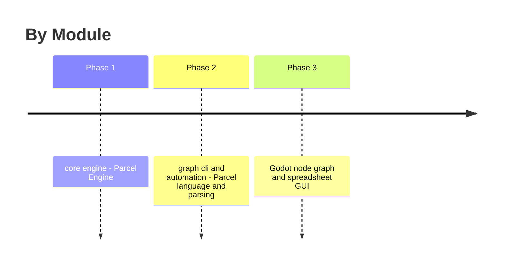

# Parcel

There is a good rationale for Houdini (similarly, TerraGen) to allow not just a multitude of properties, but also entirely customizable interface for each node - compared to Blender's brute force exposure of raw functional nodes as some graphical programming interface (like the original Parcel prototype): for much more advanced encapsulation of single node functions, this method allows much higher level operation on the underlying data. For instance, for something as straightfoward but also as complicated as "reading CSV" file, it's very reasonable to expect exposure of a multitude of configurable properties. With a graphical programming approach (like Unreal Engine or Blender), the user needs to explicitly maintain lots of configuration structures as temporary variables and the node needs to potentially expose a lot of inputs. (From this perspective, our original approach, i.e. the first prototype, is actually the best way to handle this situation - because we have the capability to completely customize a node when we need it)

## Dated Notes

### 20230126 Methodology Discussions

See this: https://news.ycombinator.com/item?id=22978454
Quote: "I've mentioned this a few times on past articles on HN, but I think the issue is we're marrying two different concepts with text based programming languages, namely presentation and representation. Consider - in an idealized context - HTML and CSS. One being the representation, the other being the presentation or more accurately how to present the representation. A user can change how the HTML is presented to them without changing the HTML directly. I think something like this would be useful for programming source code."
Is it possible to maybe devise a pure-text workflow paradigm which can be generated into a graph if necessasry? Again, the inertia of the environment can be a big thing.
Among many other "gnu general purpose node based graph editor" platforms and frameworks we discovered today (mostly are NodeJS based, to solve cross-platform GUI problem), two stand out: Node-RED and Flowgorithm.

Turns out Node-RED doesn't really work - not a well integration and every node requires a seperate module to make it very self-contained. And, it will be hard to share states between nodes. Flowgorithm is shit as well because there is no way to use packages etc. Parcel is the way to go, with C# and Python package support. However this page and the general form factor of Node-RED matches well the form factor (see this page for examples: https://nodered.org/docs/creating-nodes/first-node). The requirements are: 1) Do it Houdini style, and allow a single node to have additional less critical properties specified using property dialog instead of as inputs; 2) Alternatively, we can expose any variable-driven properties as inputs in Parcel; 3) The output itself can either represent data or execution flow (pending decision).

### 20230127 Expresso

(ALSO SEE EXPRESSO.MD)

Expresso: Grafana like ETL, for processing, not dashboarding. (Sesperation of concerns)
Key interfaces: Variables, Readers, Queries, Expressions, Transforms, plus Triggers and Writers, References. And a single Table view.
It's essentially the same as Parcel but without requiring a node based interface.

### 20230221

DrawIO is a great interface directly usable for Parcel interpretable gilr content.

### 20231031 

#### New Naming

Tags: Naming, Name, Idea

Parcel intends to inspired a new dedicated role "technical analyst" which: 1) Does analysis using Parcel, 2) Writes tools in Parcel, 3) Develops new nodes/plugins for Parcel for other team members to use. This is parallel to "technical artist" in the game/film industry. As such, we can possibly call Parcel "Anatechnica", from "analysis" + "technical". It sounds cool but is a mouthful though.

#### Parallel Comparison between Technical Artist to Technical Analyst

Tags: Concept

After developing InMemoryDB, Expresso, TFRScripting and Pure, and after gaining more experience and insight in how Blender Geometry Node, Houdini and TerraGen nodes work similarly and differently, and after gaining more exposure with non-programmers using PowerBI and Python and Excel, and after studying Prolog and Elixir with decent exposure, we are now in better place understanding the architecture needs and practical use of Parcel.

The first core idea is data as transformation, like functional programming, and like InMemoryDB;
The second core idea is Pure like flexibible extension and scripting environment;
The third core idea is that GUI is hard and GUI is very essential and efficient in doing certain things. We necessarily need to mix some sort of very high level GUI while also being able to expose some very low level text-entry for codes.

#### New Parcel Architecture and Design Master Note (Brainstorm Use, Non-Final, Non-Official)

Tags: Idea, Brainstorm, Summary, Mind map

```mermaid
mindmap
	root((New Parcel Architecture))
		Deal with Bad Programmers
			Avoid Spaghetti Code
			Should be purely functional (no state)
			No control flow should be permitted
			Be more Houdini like and focus on higher level
			Be powerful enough to be extended with in-node proceduralism if needed, but not between nodes
			Formulate as data transformation
			"Multi-context in the same graph" should allow procedural paradigm if needed, but the default is functional node-based paradigm
		Necessity/Value
			On the large scale, there is data needs
			There is automation needs
			Most analysts don't know how to use Python
				Even if they learn, outcome is messy
				Learning python is necessity due to inavalability of better alternatives
				Using Python is actually slow
				When comparing to Houdini as analogy - they just really need a tool like that
		Automatic Reflection Based Node Definitions
			What's the limit? (We discovered some limits in some experiments)
		GUI IS VERY IMPORTANT
			We should exactly "copy" from Houdini
				Provide main "current"  spreadsheet
				Allows "pinned" pop-ups
			Make Interface Very clean
			Make nodes very graphical and iconic
			What GUI technology does Houdini/Blender/TerraGen use?
			We must use some kind of GUI framework with extensive control libraries.
				This is essential for productivity.
				Even Qt or SQLite DB Browser uses Qt, which is packed with control libraries.
		Can we somehow revamp existing Parcel?
			How many versions/visions of Parcel do we have now?
			Where are ALL the scattered parcel notes?
				Can we consolidate them?
			Can we archive and clean everything else and just keep one version?
		Can we somehow incorporate Pure?
			Or implement something like Pure
			The goal is to have some "interpretation" environment for live coding
		What's an alternative GUI framework?
			In general, WPF should work.
			We know of nothing that's more efficient than WPF + C# from dev-perspective.
				.Net eco-system is very important in this.
				The only other alternative must be Python based due to existing available python ecosystem/infrastructure.
					Python is not good for GUI development.
						So we must use C# anyway.
		Must use mixed context
			Data grid (data flow)
			Control flow
			Native constructs
		Node Identification
			"Every node and parameter has a unique pathname you can use to refer to it" in Houdini
				We should also do that
					But that requires every node has a name, which can be a hassle for quick use
				The need for such in Houdini is because they have parameter reference in expressions
		Feature: Must be able to read Excel
			Node: "Excel"
				Expose file path
				Expose worksheet name
				Expose range
				Expose read-as options (as advanced properties)
			Consult Expresso on how we do it
			No need to write to excel (not as priority)
		Optimize dataflow
			Main spreasheet view
			Main advanced properties multi-tab view
			Main node tree graph
				What inputs/outputs do we expose here?
				Can we draw analogy/reference/inspiration from Houdini?
				No need to expose all parameters as pins like Blender Geometry Nodes
					In Houdini, this creates hidden dependancy though enforcing use of expressions
					In Houdini, this makes data less transparent
					In Houdini, what exactly does the connection represent - what data does it pass?
				Alternatives, we don't provide Property panel, and do expose everything as pinned inputs
		Feature: Demand C#/Python Interoperability
			Live coding support (Three pillars)
				C#
				SQL
				Python
		Pillar: C#
		Pillar: Python
			CPython
			Will not automatically generate nodes from Python definitions
				Will not parse Python
				Not possible to guess signatures
		Pillar: SQL
			InMemoryDB
			Expresso-Like
			dbt-core but makes more sense
		Won't bother dashboard for now
			However conceptually it should be supported by the framework
		What's the most efficient/productive way to make it "just work" with minimal development effort?
			Speed-to-product doesn't matter, but "managability matters"
				Extreme light-weight implementation based on existing solutions make things stable
				We don't have time for extensive development
				We want trust-worthy solutions
				GUI applications easily make me feel "unsafe"
		Production-ready and security
			Must support CLI based operations, aka. GUI=free
				GUI applications easily make me feel "unsafe"
			Must provide extensive unit tests
			Must and first of all be "usable" so it can be used in practice
			Must be easy to develop/maintain/change
				Unless due to the complexity, extensive planning and long-term development is necessary
		Long-term development plan
			It might be necessary and unavoidable
		Can we somehow make it "product-grade"?
			As some product that we can really sell
			Something that's enterprise level
			Something that can be developed by a single person reliably
			It will necessarily demand cross-platform
				Must explore cross-platform GUI solutions
					Qt?
					MAUI?
					Godot?
					Eto?
					Avalonia?
					Something other than MVVM?
				When you use WPF, must use MVVM
				WPF was made for scaling applications. Swing gets messy fast.
		Do we consider making it a web app for ease of development/accessibility?
			Web-app ISN'T accessible!
				It won't allow CLI task automation.
				It depends on cloud/server infrastructure.
				Fast NodeJS apps are VERY unstable because it's "too agile".
			Don't bother.
		What Initial Focus in terms of Libraries?
			Pandas/Numpy Equivalence
			Finance
			All pure-equivalent libraries for TFR work
			TFR Scripting-equivalance
			Can we possibly do things as large scale as Flare?
				Investigate this first.
```

### 20231102

#### "Bad Programmer" Problem

Tags: Reminder, Idea

Notice neither InMemoryDB or pandas or Python or Parcel or whatever new form of tool we come up with, it cannot deal with bad programmers or bad lazy beginners or co-ops who just want to get their job done and get the result and couldn't care less about the craft or the art of the tool itself. In that case, the more low level it is, the more power the tool delivers, the more abuse is its use. We can alleviate it from those angles: 1) Provide really high level tools, 2) Enforce formatting out of the box, 3) Provide a functional paradigm rather than procedural paradigm.

#### Surveys of Existing (Complete) Solutions

Tags: Survey, Review, Study, Discussion

WHEN THE TIME COMES, WE CAN RE-COLLECT THIS TO SOME HIGH LEVEL SURVEY DOCUMENT.

* PyFlow: PyFlow looks like almost provides what we need, while being easily extensible. Then we immediately realize the problem is not the programming environment but the "programmer" itself - co-ops, interns, beginners who care not code organization and produce very messy control flows. When we think about existing practices - **what we should actually target is functional programming**.

### 20231108

#### Node Identification

Tags: @Specification

Consider below for behavior specification.

Node Identification:

* Function name, moneic name
* Path

# General Indexed

<!--A-->
* (Architecture) (Parcel) Implemtation: Each node is associated with an immutable struct for its description and data (well, node properties should still be mutable). Don't consider Parcel as a general purpose programming language - Graphical Programming is inherently inefficient so our goal with Parcel is very specific with data processing as its specialization.
<!--B-->
<!--C-->
* (Case Study, Example) Try implement the OTPP 2022 interview case challenge in Parcel and add related functionalities; Try integrate the C# implementation as a standalone distributable package dynamically loaded into Parcel.
* (Case Study, Example) Try implement "(2022, Illustration) Income and Outcome Flow (Projection)".
* (Concept) Existing businesses using a mix of C#, Excel, Python, PowerBI and explore Machine Learning to satisfy their data needs (excluding the infrastructural needs of database servers) - and use web technologies for long-lasting online services. However, one key problem that many office work faces is the need for automation of key tasks - *those tasks can be sector-specific, but it seems that there is some pattern and generalization possible*, taking as example the Total Fund Risk team at OTPP for risk analysis. Notice also that **the seemingly repetitive pattern might arise entirely because of the well-established nature of the work and the existing processes that are specific to the work**. However, our goal here is to take tools like Excel and Matlab, which are a bit too generalized - specialize them further and *make tools that are more readily available first, then generalization second*. That is, instead of develop an editing environment that is "generally capable" first, we develop an editing environment that can "do certain tasks really well", and gradually expose more low level and more generalized functionalities to make it a full package. From this we can consider this software designed for a new technical specialization in the finance industry that we might call the **"Technical Analyst"** - someone who solves analysis problems efficiently through Parcel scripting, or focus on building tools for other analysts by using Parcel. Under this context, Parcel will be the main (and ideally only) software they use to solve their **data (storage and processing), processing (processing and business logic) and presentation (presentation and application development) needs** - that is the big picture, and the way we want to approach it is to "hide it all" so the interface looks very very simple and even "看起来没什么", the rest are "frameworks" that only starts to show its power when people gets to use it (and thus jumps from an "ordinary user" to a "technical analyst").
* (Consideration) I was thinking about it would be nice to be able to populate procedural contents in an ordinary text editor - e.g. inside VS Code. In the end we have to use Colab to populate random list of array numbers into files. However, when you look at Excel - its cell formula sort of achieves this kind of functionalities - it can quickly rerun, it's meant to populate data and nothing fancier. We might want something similar in Parcel while trying to avoid things get abused and cross-referenced. At this moment, the single only usable case is: *To generate blocks of random numerical data, or to generate list (row or column) of random string data, or to generate a sequence of numbers*. What we can do is to make those two specific functionalities as some kind of "Macro/Actions" for **Data Entry Table** or **Grid Entry** nodes (similar to how we might provide "Flip/Mirror" actions), with minimal customization through some parameters popup for the action. However, this setup do not have automatic re-run capability.
* (Consideration, Marketing) Notice the color-coded nodes might not appear friendly to color-blind people.
<!--D-->
* (Data Sheet Editor) Show row number and header name (default ABCDEFG) - allow Ctrl selection by compatible type and "Extract" context behavior to quickly extract subtables.
* (design, Concept, Summary) Parcel - Single stop for your data processing (data storage, data indexing, etc) and workflow (presentation, business logic) needs.
* (Discussion) C# doesn't support scripting; Python has weird package management; MATLAB is too bulky; Octave is too much like Matlab; NodeJs has uncomfortable syntax - it's just nothing there to do data processing that's cool and elegant and just convinient.
<!--E-->
<!--F-->
* (Feature, Idea) Create procedural Excel from Parcel, with "This Excel document is generated from Parcel - the Magical Workflow Engine. For proper business operation management, you should not modify or reuse any content of it." This is to ease the transition - for users to be able to communicate the general processing logic to other business partners who don't have Parcel.
<!--G-->
<!--H-->
<!--I-->
* (Implementation) Instead of compiled C#, declared nodes simply requires a simple execution tree iteration to execute. (Unless text based scripting languages, there is no syntax parsing need for this kind of interpretive execution)
<!--J-->
* (Justification) Usage of SQL: Some people (Kong, maybe even Ray) find it too "technical". Finance people use it all the time; It's essentially the same as Excel formulas, but much more powerful, and it's easy to learn (it's designed that way).
* (Justification) Usage of Python: It's a scripting language, it's easy to learn and ubiquitous; It's only used as an interface language (we don't depend on other existing popular Python libraries).
<!--K-->
<!--L-->
* (Library) Provide a Mouse/Keyboard automation library for replacement of Macro Recorder etc.
<!--M-->
* (Management, #Segmentation) Team Functions: Architecture/Product Design & Consistency (aka. Charles Zhang), Marketing, Parcel Online & Cloud Solutions ("Frontend"), Graphics&Sound & Styling, Strategy/User Expectation Auditor, Add-on/Extension, Graphing Capabilities, Core Flow/Engine (Core Desktop Modules, "Backend": As long as Engine and File Format is transferrable, the whatever front-end doesn't matter), Website and Ecosystem Management, Variant & GUI Experience (multiple client style, cross-platform GUI; C++ implementation; The "Implementation" team), Documentation & CoreSpec (CoreSpec publish behavior across implementstions and document reference implementation, including View, Engine and Node Library), EcoSystem and Package Management ("Maintainer").
* (Module) AutomationToolbox will have to provide program flow constructs and (localized) global state affectors. For instance, a Repeat node will effectively turn whatever is after it a nested function. Or to simplify things, we can require Repeat node has no children, and input as parameter a Node Group to repeat (and the node group automatically correspond to a function). It will also provide nodes like SetState with a dictionary like mechanism to modify a global state.
* (Module) Finance Toolbox: Just see what Excel functions are there, we will need to provide all.
<!--N-->
* (Naming) Somehow
* (Naming) Notice our "Workflow" is Houdini-style, or World Machine/TerraGen/Blender style, rather than UE4 Blueprint style, thus it is more precisely named "Data Flow" instead. The key distinction here is in a data flow diagram there is no way to describe program execution flow control primitives like for loop - there is not even branching, and that's intentional, since everything is immutable and THERE IS NO GLOBAL STATE. Each node is independent - it concerns not what's before it or what's after it. It's like functional programming.
* (Naming) "Parcel" per "Parsec Excel" or "Surpassing Excel". Pronounciation: /ˈpärˈsel/, not /ˈpärsəl/. **Parcel Editor** is the integrated editing environment for a **Parcel Package**; It contains 3 major components: **Parcel Table**, **Parcel Workflow**, **Parcel Present**.
* (Naming) Vincent recommended "Dataflow", like "Tensorflow". It's neat, but it sounds too generic.
* (Node, #Proposal) Python Node - **Grid Compute**: like an automatic two-layer loop, takes a Data Table, Rows, and Columns, and as parameter a snippet for actual inner execution code. The code has access to five parameters: data, row (0-indexed), col (0-indexed), (cell)value, headers (array). The nodes runs the snippet as the body of the loop and generates a new Data Grid. For instance, if the snippet just return value, then it's the original grid; If no return statement is given, it automatically returns the result of last expression. This node can be handy for purely 2D data processing. The operation maintains column headers.
<!--O-->
<!--P-->
* (Presentation, Design, Idea) Some presentation topics (5-10 min): 
	1. "End-to-End": From data source directly to reporting.
	2. Overview: Better Life with Excel (or Hold Control over Data)
	3. "Self-Documentation": How to Create Self-Documenting Business Process
* (Presentation, Discussion) Here is some dimensions to mention when people want "proof" why Parcel is useful when compared to other things they are familiar with: 1) Time to iteration (this is the key, including setup time, real-time experiment, and variation), 2) Logic Clarity (Minimal syntax, you get what you want, What you think is what you write is what you get), 3) (Zero/Minimal) Debugging and Syntax Error, 4) A workflow graph is Self-Documented when used properly, 5) Reusability (this is another key dimension, especially when compared to Excel, and even when compared to Python and C# since we can import other graphs using absolute path. 6) Cleanness/Ease of Use/Explorability/Self-learningness: A node graph and node-based operations are self-taught due to its graphical and exposed nature. For minimal usage, is software almost requires zero learning, compared to Python/Matlab, which is impossible to guess how it's used without technical learning, and compared to Excel, whose table function required no learning but processing function required lots of learning and documentation and yet it still contains lots of limits and quirks. 7) Cleaniness: You see both the logic and the data at the same time, unlike Excel where you see only data, and unlike Python where you only see the code; It's like Jupyter notebook, but 2D (and slower); Since we are not copying around raw text data, there is no potential human operational error when manipulating those data (compared to Excel), and it's easy on your eyes. 8) "End-to-End": From data source directly to reporting.
	* (Parcel, Discussion) Additional dimensions for comparable features: 1) Compactness: Smaller raw Parcel Data Table binary data storage (show some Excel, CSV and PDT file size comparison table), Small graph file size (minimal, and can be stored anywhere, takes no space), reference based and easy management of file relationship (avoid redundant and second-hand copy), the graph describes a procedrual and changed-based modification that's non-destructive and don't modify the source file. 2) Visual debug - you can see at which step of data processing thinga went wrong directly on the graph.
	* (Related) Also "How to Create Self-Documenting Business Process" sounds like a promising idea - in fact, we can do that presentation with Victor's meeting for the last round of OTPP interview, also to persuade him for something greater.
* (Presentation, Discussion) (Parcel, Comparison, Excel) Excel sucks because: it has very weird memory model - memory limit, single instance workbook.
* (Principle) Parcel is designed for **NON-PROGRAMMERS**. It intends to give the flexibility of a scripting language like Python or MATLAB.
* (Production) Someone mentioned we should TM Parcel before join the company to avoid potential ambiguity between work time/personal time development - actually, more specifically we don't want the trademark, we want the copyright. To obtain indirect lawful legal protection, file a patent on software with a patent agent in Canada.
* (Publishing) https://creativedestructionlab.com/program/ - might attend this when the software is mature and see how we can push it further?
<!--Q-->
<!--R-->
* (Reference) Similar ideas: Houdini, Blender Node, World Machine, Nuke, Grasshooper, Dynamo BIM; Power Automate is like Powershell (wrong design, like MS's C# WF and JavaScript graphical programming).
	* In terms of popular data processing platform: Python, Jupyter Notebook, Matlab
	* Other examples to learn from: Mathematica, Origin Lab
* (Reference, Discussion, Differentiation, Comparison, Definition) Notice our solution is different from ETL/ELT or AWS Sage Maker (https://aws.amazon.com/sagemaker/data-scientist/), which focuses on database interaction and graphical SQL builder. As can be seen here (https://youtu.be/YOn9hGCwmrA) and here (https://youtu.be/H75HxdLuR7k). The best understanding of our tool is Excel+PowerBI (or RiskHub)+Python Automation, and it's designed for real-time data analysis and processing rather than (I am not even sure what problem the ETL is trying to solve) making stupid business applications. When we say we intend to replace Excel for data processing we should be very careful - until we have powerful formatting and report generation capabilities, we don't intend to replace Excel completely, rather, it's offloading analysis jobs to Parcel, and hopefully we can reduce dependancy of business on C#/Matlab/Python for those data exploration tasks. Again, it's opening a new role called "technical analyst (in Parcel)" (like technical artist) - our tool is "technical analysis tool", it's in between traditional financial analyst and traditional programmer (just like technical artist in Houdini).
<!--S-->
* (software, idea, project, proposal, todo, Qt, #Excel+) Write a excel replacement per our earlier idea on object based linked (unstructured) scripting sorta concept. (Where is that concept?) For Qt related basic resources/research, see bookmarks "qt, example, video, tutorial, todo, session, 20210130_qt". Consider abstraction/simplification of operations as List-based operations instead of table-based operations.
	* (Concept) Make it visually scriptable (可视化编程) so basic operations like sum two tables (lists) etc. are very easy.
	* (elaboration) Can be tuned more specifically for Project Nine database use - clean interface. As a database, it's more like Excel, but unlike a database, it's neither document-based nor relational. CoachDB's syntax is just riduculous now I am already regreting it. The key features I demand: portable-single-document-storage, casual-text document like editing for human first, maybe Formless integration or some other custom scripting form. LIke SQlite, it's for small scale, but less tedious and less overhead - it's more like Excel, but structured.
	* (idea, proposal) It should be **entity** based - identified by **name** stores **data slots**. Data slots are of different types: *table*, *text section*, *metadata* (attribute fields). The table contains "live scripts" that can automatically do updates when things change. In addition, there is "operational scripts" that can operate on those data. In the backend, all those things are stored as a single Markdown file - using special HTML tags or pure text delimiters to denote particular sections?
	* (Question, alternative, solution) Is there a workflow based conventional-format style alternative to developing an app, which will take forever before we even start putting anything in? (Name) Let's call it "Super Grid Data Workflow". (Proposal) 1) Use VSCode Edit Csv (or Simple CSV Editor) as csv editor, and use Rainbow CSV for query. 2) Put everything inside a flat project folder: Datatablse (csv), Data document (yaml), Text documents (.md), images and binary resources etc - no subfolder is allowed; 3) All files should follow a naming convention: standard KMD tags format followed by a GUID, which can be optional if no particular identifier is needed for that file. *As a convention*, if a GUID is given, it should be unique, and it will be automatically assigned to a `name` attribute for that data file, and no other explicit definition for that attribute is needed, but if provided (e.g. inside a YAML), it should match the GUID. 4) Optionally, a Master Descriptor File can be devised to provide high-level links among all files (e.g. primary keys, foreign keys for datatables in a ralational style) and save the effort for a viewer program to parse each specific files, or for other management purpose - this MDF might by all means be application specific, so it's written in DSL, a scripting language like Formless (maybe it can directly embed processing instructions as well). 5) To perform queries, basic full-text search should be trivial.
	* Key idea: seperate processing and presentation so make data self-contained and clean.
* (Specification, Implementation) Everything is usually a separate window - easier to implement, naturally support multi-monitor.
* (Specification, Design, #Change, File, Format, Management) Parcel - Workflow Engine: The entire project can be a folder - nodes except binary data are in plain text format (either S+MD or YAML), so things can be version controlled. We can even Integrate a git. The original single YAML project file can still exist for smaller stuff.
* (Specification) All assets used in this project must be original so we can easily publish it under Open Source, including icons and music.
* (Specification, Usage, Concept) Pre-Input: All named literals can be set before workflow started through a map specification (like environment variables or named program arguments). That is, there is no need to explicitly change the graph node value in order to do different things. In fact, we can go further and provide embeddable Presets (functions the same as pre-inputs) directly inside the project file for quick configuration. This can go further and allow direct overriding of specific node attributes. This works just like USD layering it's just our workflow is not "layered" as USD.
* (Specification, Prototype, Proposal) To avoid potential abusing and unrealistic expectation from a prototype as production tool (e.g. finance people just don't understand it takes months for a software to become mature) - we will NOT provide saving/loading until Parcel is production ready.
* (Specification, Implementation) For actual workflow execution, instead of doing interpretation, we can actually compile things down to C#. If that is the case, for iteration 1, we don't need to do CLI/YAML, but plain C#.
* (Specification) High Level Behavior Specification - Here are the expectations from user's point of view:
	1. Easy setup: It's a single app, ideally single executable, and battery packed, without other dependencies
	2. No coding: Basic usage of Parcel shouldn't even have the slightest trace of coding need.
* (Specification, Prototype) A node graph can have Input and Output node primitive. Also, Graph is itself a primitive.
* (Summary) Feature: 1) Excel that's actually usable/managable; 2) Faster performance, smaller size, no strings attached; 3) PowerBI replacement: Dashboard, instanta LAN share; 4) Workflow scripting through diagrams: build custom data processing logics; 5) Extensive scripting and component/plug-in framework with very easy access (Python) <!--See how we can make things debuggable-->. 6) Super clean; 7) One-time purchase, free upgrades forever.
* (Summary) Tradtionally when people need to process data they use Excel or Python; Parcel provides a friendly user interface for the same functionalities.
<!--T-->
* (#Technical, Note, #Development_Note, #20220408) Notice that it seems Expando objects can have variable names of varying formats (including spaces, and special symbols), but for WPF DataGrid binding, it at least cannot handle property names that contain brackets.
* (#Technical, Note, #Development_Note, #20220409) Looks like it's neither about Async or secondary thread that's causing ASP.Net core issue when hosted inside WPF, it's that as long as it's initialized as a calling assembly, it's causing problem.
* (Toolbox) PlayGameToolbox: Snake. (idea from) Nowadays smart phones and TVs don't come with games, that's lame.
<!--U-->
* (Usage) An editable table has fixed cell size - its document window is not resizable, on the contrary, expanding such a document effectively adds more editable cells to the grid. Alternatively, we provide input fields near scroll bar, this will also work on larger tables.
* (Usage) We do not intend to replace excel completely: Anything like custom formatting and data accessing can still be done in Excel; But anything like data processing, pivoting, data analysis, should be moved to Parcel. We provide direct read and write from and to Excel as table format.
	* (Usage, #Proposal) An advanced usage scenario is to create an excel "template" with some cells containing replacable strings, and go through a Parcel workflow to replace those cells with certain values and generate a copy of a new excel file with those fields filled. (One the most basic level, this can be exposed as a string-cell replace node on Data Table, and we will not be handling cells that are merged together in excel)
<!--V-->
<!--W-->
<!--X-->
<!--Y-->
<!--Z-->

# Design Methodology

The key idea is to work like Houdini: Allow digesting income sources of data from external files, perform processings on those data, and generate preveiws either in-app, or export as other data formats.

We must understand this application (unlike many others I develop as personal projects) is NOT designed for myself - for all mundane tasks we could just use a combination of NodeJs, Python/Colab, C#, Octave, Powershell, single-page HTML etc. to achieve my needs. Thus we must listen to and consider carefully potential clients' actual needs. All-in-all, **Parcel** is intended to be a *self-contained stable runtime development environment for data processing needs*; The key here is *robustness and reliability* - *the algorithms, capabilities and efficiency can change in each updates, but data processing needs and the interface should be timeless*.

Especially when considered as **"technical analyst"** specialization, we want everything to be as **text based** as possible (so someone can hack it when needed), this includes overall application data storage, raw data, procedural data and input and outputs. This make things programmable, and it also allows people to use keyboard more and is thus more efficient. The main comparison is between this and Excel/PowerBI/Tableau - the later has too many clicks and drag things around and is 傻瓜式/stupid and very inefficient and is NOT procedural because everything is actually manual labour. The design principle of our interface is to be as simple as possible - abvoid all clustering; And to serve the purpose of simply access of functionality and aid in automation of things.

# Rev.02

(Parcel) Use WPF to write multi-window with a single Graph Node window for workflow. HOWEVER, the workflow engine can actually be a separate piece of software that runs on its own so let's do it this way (Workflow will support reading Parsec) - use external editors for editing first; Then Parsel will be a dedicated single-doc editing environment (ideally multi-document for self-containess) - we do nred a UI view for this because we need real-time editing capabilities but is therr anyway to simplify things?

This time if we are going to do it we will do it with a scale, collaborate with Warren to see how we can improve the workflow dramatically. Consider and enable collaboration features early on, use Net Core and have embedded servers for all sorts of features. Make the app very self-contained and simple yet feature rich through extensive C#/JS/Python scripting.

Do UX design first and only after that do we write code.

Serve as a Dashboard.

(Parcel Editor) All procedural/"formula" stuff should use directly Python - we don't need to do another layer of custom syntax, nor do we need to support Excel syntax - how can however offer directly translated shortcuts that converts Excel syntax in-place to correct Python formulas. For instance, a procedural column (different from procedual cell or cell override, which is considered rarely used) is a function that generates a whole column/list directly, and it can be treated as a python Function that takes as input the various metrics of interest.
(Parcel Workflow) For all script inputs (notably Python and SQL), we should allow dynamic named inputs defined with $VAR()=Default$ (a macro) syntax. Make this apparent by showing a tip in Node properties window.
(Parcel Editor) Notice Parcel Editor's core functionality is Table editing - we expect this to get complicated. But we make sure to provide ONLY editing, no formatting.
(Parcel Editor, Parcel Presentation) For presentation purpose only (it cannot be used as inputs for other nodes), we have a Compound or Formatted Table node - it allows to slice and assemble a spreadsheet like area just like how Excel allows it - but it only references strongly typed nodes as its components and everything else is plain text cells that supports no computing. A typical Excel scenario like "Country, Population" then comput a "Total Population: Number" at the bottom of a table would be translated in Parcel as a strongly typed Csv table plus an Evaluate cell for total population and a plain text "Total Population:" cell put together inside a compound table. Might need to support some basic string operations for better formatting of cell contents. It's also forbidden to cross reference cells inside a Compound Table (Spreadsheet) to avoid users abuse and embed computations inside. A "Library" side pane is helpful for this node to make clear what components can be inserted.
(Parcel Editor) Self-Contained Input-Output Workflow Package: We can allow Parcel-dependant (use Parcel as application host) scripting application development (sort of like Excel macro and formula based input and outout) by some sort of multi-workspace packaging (different from current node-based indexing). That is, a Parcel package ".parcel" should be able to be opened, and contain multiple Datablock and even multiple Workflows (aka. a self-contained Parcel package intended to be opened with Parcel) - one way to implement is allow automatical relative path when those files are under the same folder. Then in this case the program should be able to present the interface such that (maybe per some master workflow) prompts a workflow/table edit workspace that collects user input, executes some tasks based on those inputs, repeats and until job is done.

## Software Architecture

Might want to make the core functionality (including GUI) as small as possible - focus on Table and Workflow. And add everything else as Module, Plugin and Component/Extension.

(Parcel) (Implementation) The application is node based and not filed based - each node contains information on its storage location. Parcel will not load an entire fact and keep things in memory as the mastee copy. Instead: Like SQLite, assuming Windows allows only one process to write to the same file at a time, there will be a Users datablock inside Parcel package that represents all instances that are currently using which nodes inside the parcel - using a random GUID as representation during application start. (Behavior) To the users: a particular physical node can be loaded in multiple Parcel instances (even cross network) and can always be modified (we might not want to Auto save any nodes in this case); When other programs uses the same node, they will check whether that node is updated. (Implementation) All nodes are saved individually inside a .Node file - we can use a Red border along with italic "Needs Saving" to dictate modified nodes. Ctrl+S should be able to save all nodes at the same time but conceptually all nodes are saved separately (though we also require all package data are stored inside a single binary zip file). Data transfer formats like YAML workflow files are NOT the actual final storage of nodes - they can be loaded/imported in memory and can be exported back but should generally not be the default final storage format (which are parcel files).

## Some Imminent Problems

1. How to deal with the situation that Excel allows arbitary cell-based text formating (e.g. string operators) and non-structural table representation? One way to deal with this is to use Compound Table, the other is to not allow doing that with our app at all.
2. How to properly represent logics that involve **batch job** and potentially more complicated loops with dynamic iteration size? One way is to avoid having dynamic loops that can break out and avoid changing internal states - make sure everything is immutable.
3. How to properly program/handle (with algorithmic efficiency) hyper-tables?

# Summary of Key Innovations (And thus key area of focus of development)

1. Table as Objects (Parcel Table), it's like having the entire NumPy combined with Excel - in this sense, it's actually more like **Matlab**.
2. Node-based workflows (Parcel Workflow)
3. Presentation Ready (Parcel Present)
4. Sparse CSV/Tables as SQL Query (SQL from Files)
5. Hyper-Tables: Tables are strictly 2D map - they are lists of objects with typed attributes; A hyper table is an attribute that itself can contain non-singular data types. In this sense, we have (as table) lists of objects whose attributes can be compound objects rather than simple types (hyper-tables). For traditional 2D table visualization, such compound data cells are simply shown as: *(Compound)* or *(List)* or *(Object)*. Also, table cells can always either: Have value, have null value (*null*), do not have value (*(Uninit)* for uninitialized), or have invalid value (*INVALID*) - empty string is a string with value, it's not uninitialized!