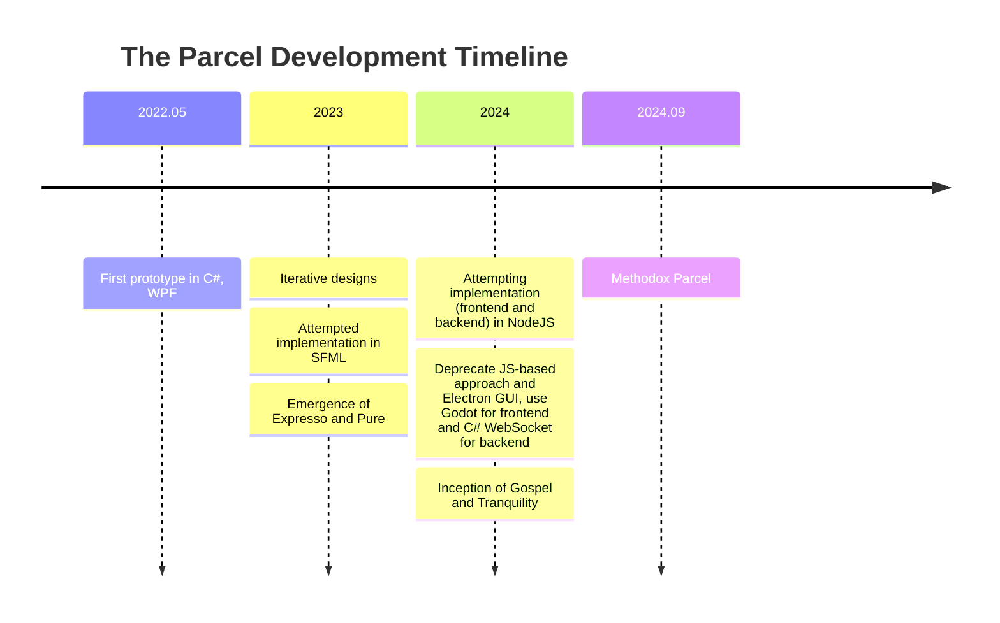

# Parcel NExT

Parcel is a general-purpose visual scripting platform and workflow execution engine. The Parcel NExT platform is an ecosystem surrounding what's known as Parcel Open Standards (POS). This is the current *active* repository for the official reference implementation.

Formerly known as ParcelV7. This repo contains the runtime and other core components for Parcel NExT implementation and some of the less-complicated front-ends. This repo is open-source for general accessibility; More dedicated front-ends are managed in specialized repos.

<!-- Keep it brief. -->