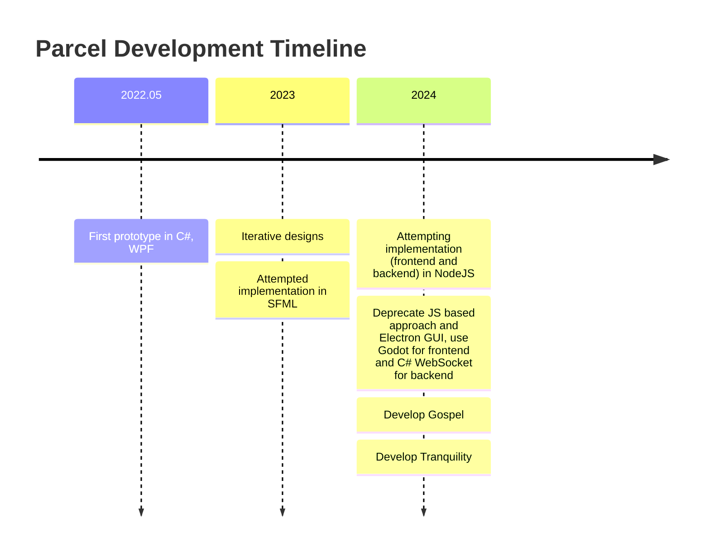

# ParcelV7 (Parcel NExT)

General purpose visual scripting platform and workflow execution engine. This is the current *active* repository containing the official and final attempt of implementing Parcel, this time focusing on Electron as frontend.

