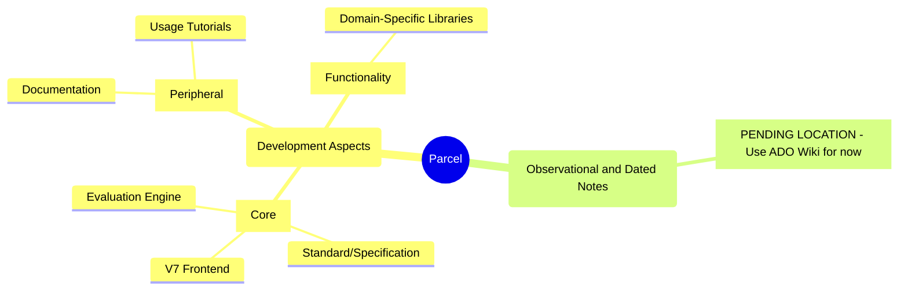

# Parcel (General) Development Comprehensive TODO List

<!-- Migrate this to ADO! -->

This is the single-place reference for all TODO items for Parcel development.

Also consult: 

* (Parcel V7): [Issues](https://github.com/Charles-Zhang-Parcel/ParcelV7/issues), 
* (Parcel V7) [Discussion on Features](https://github.com/Charles-Zhang-Parcel/ParcelV7/discussions/categories/ideas)
* Organization [README](https://github.com/Charles-Zhang-Parcel/.github/blob/main/profile/README.md)

## Current(<3)

Current in-progress items:

- [ ] (Management) Org and repos re-organization, design notes migrations
- [ ] (Parcel V7) New open standard and design specification draft
- [ ] (Experiment) Preliminary visual design, functional Electron implementation, and modular/plugin architecture

## Personal Items

### Current as of Feb 2024

(Consider organize them to ADO)

Core Engine: 
* Common conversion - from types to types. string/obj, string - obj, json, data grid.
* Dependency solver

(Investigate running godot as dedicated headless server on Linux with replication - may be supported out of the box)

Implement Gospel native Process run node.
Node Browser -> Library Browser -> Focus on Custom Node
Process Management - Run Process node: Standard Input, Command, Arguments, Standard Output, Standard Error

(Demo) Editor Benchmark
(Macro nodes) Populate 100 Nodes, Populate 1000 nodes (Interconnected)

Allow nodes to be switched as Headless or Header format - aka. this display is node agnostic.
Make a mock node for SQL Builder (single-node), provide: Select item list, From table list, where clause, on clause

(Consider putting to POS) Run/Debug: Like Execute Node context menu, runs one by one using reflection.
Execute: Run optimized version and auto-planned implementation, might not be fully debuggable/observable. Though code/execution plan. will be shown.

Minimal implementation for presentation: ReadCSV (with many options), ComputeStats (with varying outputs, including All pin), and Preview node (with toggle between table, JSON, Tree, Field Map formats.
ReadCSV
ChooseFile
ComputeTableStats

(Gospel) RMB Menu:
Primitives: Number, String and Bool are all implemented as primitives; 
Operators: +-/* are all implemented as "operators" and handled directly in Gospel front-end WHEN only primitives are connected as inputs.

(Parcel) Implement Demo.Exec and see how we might make it work.

F11: Display_Hide_All_UI
F12: Display_Presentation_Mode (Lock node movement and resizing and disables all other shortcuts)

Test table TreeItem set editable
Node Properties Panel: Add action - Copy Unique Name (can place it directly near header bar) (This is useful for technical use, e.g. assigning attributes as references without exposing as Input pin)
Gpspel measure and log node run time.

Guess game node (single input, text print output, no payload)

Work on AmaEngine
Stated endpoint: CreateNode, Update Attributes.

(Gospel) Graph Editor (below action tray)
Grapp runtime: Hybrid, Reflection,  C# (Code), Python, Logic, Functional.
Tool tip: Picking a graph run time restricts available nodes on that runtime.

(Parcel)
Save payload to node
Implement Preview node "Source" input
Hook on_connected() events for all nodes
Implement specialized Preview node for displaying table content upon incoming connection with valid payload
When payload is updated, call (only) immediately next connected nodes on_incoming_data_updated event

(POS, Appendix) Node Attribute
(Tentative) Anything after ~ in node attribute names should be intercepted as comments - front-end might display those as tooltips. At least, it should be implemented as a reserved feature.
(Section) ## Naming Conventions
All node attribute follow JSON and GDscript naming convention aka. snake case. All C# modules should use proper C# convention, and Python modules vice versa. A strictly followed naming conversion will be implemented and handled by the backend for missing attributes when mapping to function/type method calls, and thus following such convention when writing libraries are advised. Node names are PascalCase.
All nodes and pins for front-end with have proper "Human Natural Language" format with proper spacing.
(Design Decision, #20240213) Attribute level comments might make node graphs too verbose. An alternative is to provide a parsed "Style-sheet" that "drops-in" providing archetype-like functionality, adding comments through layering in a tartget-type-attribute addressing schemes. Either way, having ~as reserved special format is a good thing.

### Current as of 20240331

Casual progress:
* PSL and functional overall processing pipeline (Ama engine)
* DataTable: Provide Change Size, Change Headers with dedicated pop-ups.
* String-based Array Node

Gospel frontend:
* Exception display (backend-frontend communication)
* Notification push

Gosple Nodes:
* Might want to provide Data Table and Spreadsheet an input of DataGrid which ONLY when changed populates values. (And might want to automatically disconnect?)

Core engine and usability:
* Replace Notebook with Parcel implementation for Singleton context Pure (by simply providing some nodes where we can type the snippets)
* Backend to front-end communication (Create node, create payload, update attributes). When this is done we will be able to load documents.

### Unofficial Tasks as of 20240510

Pending moving to ADO when tasks are official.

(Feature) Preview Node
(User Story) Add Audio Mode (Per DSP DSL)
(User Story) Add Video Mode (Per Video Editing DSL)
(User Story) Add Viewport (2D) Mode (Per 2D Graphics Novel Game DSL)
(User Stort) Add Viewport (3D) Mode (Per Procedural Modeling DSL)

(ADO) (Story) Investigate Advanced Custom GraphEdit Drawing
https://www.reddit.com/r/godot/comments/17apon5/possible_to_animate_edges_in_a_graphedit_node/ Might need to touch C++ source, which is not too much, but we must ensure Windows/Mac/Linux/Web builds still works and we are able to easily maintain forward compatibility with new engine versions, in general, avoid excessive changes.
Put results in Investigation folder.
- Study behaviors
- Summarize in design document
- Create demo setup

(ADO) Marketing
-> Personel Marketing
-> Name cards: Charles Zhang (CEO)
Charles Zhang
CEO
Methodox, Inc.
Mobile: +1 (647) 382 6850
Website: www.methodox.io
Email: Charles@methodox.io