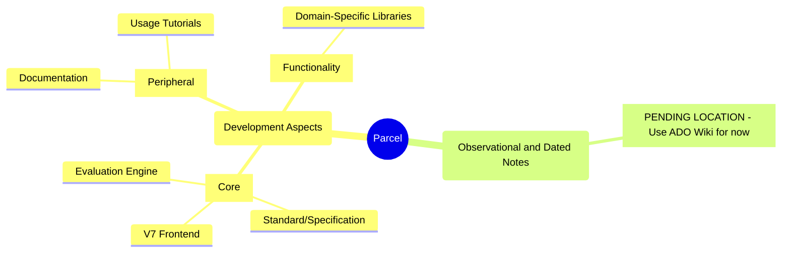

# Parcel (General) Development Comprehensive TODO List

<!-- Migrate this to ADO! -->

This is the single-place reference for all TODO items for Parcel development.

Also consult: 

* (Parcel V7): [Issues](https://github.com/Charles-Zhang-Parcel/ParcelV7/issues), 
* (Parcel V7) [Discussion on Features](https://github.com/Charles-Zhang-Parcel/ParcelV7/discussions/categories/ideas)
* Organization [README](https://github.com/Charles-Zhang-Parcel/.github/blob/main/profile/README.md)

## Current(<3)

Current in-progress items:

- [ ] (Management) Org and repos re-organization, design notes migrations
- [ ] (Parcel V7) New open standard and design specification draft
- [ ] (Experiment) Preliminary visual design, functional Electron implementation, and modular/plugin architecture