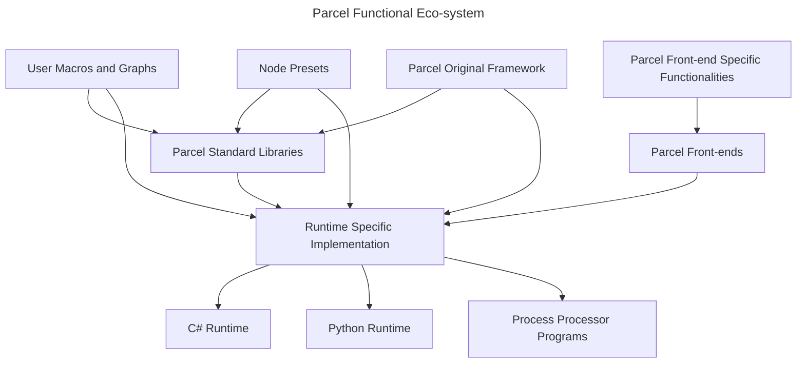

# Parcel Standard Libraries

<!-- Consider moving this as part of Parcel Open Standard Proper, and enumerate only the libraries in Wiki, not the intention/specifications. -->

From a Parcel-native perspective, we provide a layer of indirection from user graphs and underlying implementation, to remove the direct dependency on implementation-specific functionalities. For instance, `Print` should be a standard Parcel node with standard behaviors, irrelevant whether it's implemented or mapped directly to underlying C# or python or custom implementation. The direct source of referencing when devising such a standard library follows the clues in this order: standard lua library, standard C library, standard Python libraries, standard .Net libraries, standard C++ libraries, standard Pure libraries. Notice when we reference those libraries, we reference both interface and behavior - but more importantly, the intention of providing such functionalities and the ubiquity of the application. Below we provide some high-level rationale:

* **Standard Lua library**: Lua is mature and lightweight, the standard functions that it choose to expose must be very essential.
* **Standard C library**: C is general purpose and can be used for both low level and high level applications, and the standard library it provides can be seem as essential for general purpose programming.
* **Standard Python libraries**: Python is high level and its standard libraries must be useful across domains.
* **standard .Net libraries**: C# is highly productive and daily operation on those depends heavily on standard libraries.
* **Standard C++ libraries**: Especially modern C++ provides some high-level and very advanced libraries.
* **Standard Pure libraries**: Pure is battle-tested and domain-specific tested.

Considering maintenance cost, PSL might only provide which that are essential, and relay additional modules to implementation/runtime dependent availability. But the general hope is through time, we gradually remove such runtime dependency and provide a set of standard functionalities. On the other hand, all functions of Parcel Original Frameworks should be considered Parcel-native. Notice different Parcel frontends might also provide nodes that are specific for the purpose of frontends.

From a user perspective, the best approach is to:

1. Use POF if intended functionality is available
2. Find available Parcel-Native User Modules
3. Stick to standard runtime (C# and Python)
4. Use 3rd part and custom DLL libraries as last resort

## Statistics

Foundation Classes:

* PENDING

Foundation Methods:

* PENDING

Nodes:

|Node|Signature|Description|Inputs|Outputs|Options|Is Macro|Technical Node|
|-|-|-|-|-|-|-|-|
|Stats||Mega-node for computing stats of interest across common dimensions for entire data table. Preferable for quick analysis.||||True|Very efficient, only executes output paths when used.|

## Parcel Original Frameworks

> Start with really simple things.

Paecel is generally purpose of course - but that's just the versatility; In terms of utility, it's an interface to one-shot graphs. <!--(Idea from) It's just a better version of Excel, sits between Excel and Matlab, for data analytics - think in terms of a hypothetical Data Service library, where each node is a named entity we want to play with; Think of drag-n-drop RegexRename. -->

* Make simple things trivial
* Make straightforward sense
* Smart contextual behaviour