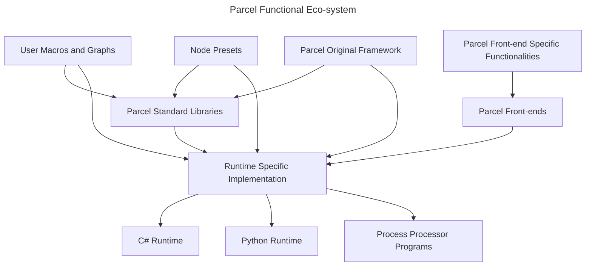
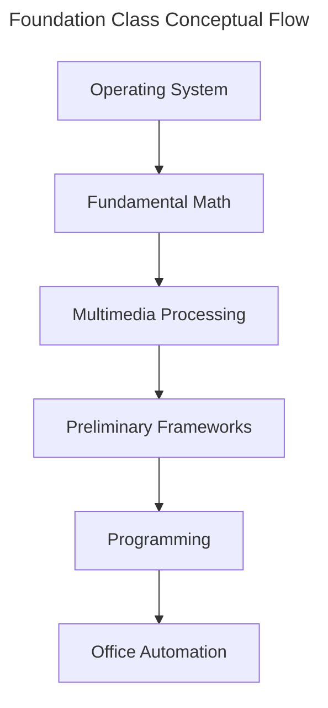

# Parcel Standard Libraries

> Everything is a Node!
> Everything is functional (and likely pure)!

<!-- (Remark) This is function library - it doesn't concern with Parcel constructions, both in terms of front-end and backend; We may however expose certain constructs through PSL (e.g. we could expose the Number type here) -->
<!-- Consider moving this as part of Parcel Open Standard Proper, and enumerate only the libraries in Wiki, not the intention/specifications. -->
<!-- Notice we had a Draw.io diagram from earlier Parcel design notes - migrate it here. -->
<!-- (Remark, Design Note, Principle, #20240326) Notice the goal here, CONTRARY to typical programming languages like Python and C, is to provide high-level business/application related functions (as single nodes) first, then provide programming features. For instance, a large suite of C++ STL is for foundational programming, while all of Excel and MATLAB functions are for domain-specific computing. Because of the nature of graph-native approach of Parcel, it is NOT suited to follow the steps of either: Parcel should first and foremost "get things done", then it gradually expose more control and programmable features. -->

From a Parcel-native perspective, we provide a layer of indirection from user graphs and underlying implementation, to remove the direct dependency on implementation-specific functionalities. For instance, `Print` should be a standard Parcel node with standard behaviors, irrelevant whether it's implemented or mapped directly to underlying C# or python or custom implementation. The direct source of referencing when devising such a standard library follows the clues in this order: standard lua library, standard C library, standard Python libraries, standard .Net libraries, standard C++ libraries, standard Pure libraries. Notice when we reference those libraries, we reference both interface and behavior - but more importantly, the intention of providing such functionalities and the ubiquity of the application. Below we provide some high-level rationale:

* **Standard Lua library**: Lua is mature and lightweight, the standard functions that it choose to expose must be very essential.
* **Standard C library**: C is general purpose and can be used for both low level and high level applications, and the standard library it provides can be seem as essential for general purpose programming.
* **Standard Python libraries**: Python is high level and its standard libraries must be useful across domains.
* **standard .Net libraries**: C# is highly productive and daily operation on those depends heavily on standard libraries.
* **Standard C++ libraries**: Especially modern C++ provides some high-level and very advanced libraries.
* **Standard Pure libraries**: Pure is battle-tested and domain-specific tested.

Considering maintenance cost, PSL might only provide which that are essential, and relay additional modules to implementation/runtime dependent availability. But the general hope is through time, we gradually remove such runtime dependency and provide a set of standard functionalities. On the other hand, all functions of Parcel Original Frameworks should be considered Parcel-native. Notice different Parcel frontends might also provide nodes that are specific for the purpose of frontends.

From a user perspective, the best approach is to:

1. Use POF if intended functionality is available
2. Find available Parcel-Native User Modules (PNI and PSL)
3. Use pure front-end specific features (e.g. native Gospel implementation of Spreadsheet node)
4. Stick to standard runtime (C# and Python)
5. Use 3rd part and custom DLL libraries as last resort

## Database Foundations

### Database Functions

PENDING

## Data Grid Paradigm

### Table/Cell Operators

* Aggregate: Aggregate two Tables by a single common attribute; Equivalent to Join + Sum in SQL
* SQL: Execute a SQL command in place with Pseudotables. Inputs: Multiple tables as data source.
* Pivot

## Finance, Economics, and Investment

Provides financial product pricing models.

* Black Schole for European Call Option
* Black Schole for European Put Option
* Discouting Price with Risk Free Interest Rate

## Math and Foundational Computing

For domain-oriented usages.

### Basic Excel Functions

* Average
* Rand
* Vlookup

See discussion: https://github.com/Charles-Zhang-Parcel/Parcel_NExT/discussions/10

### Basic Arithmetics

Notice despite native expression evaluation and front-end side nodes that might facilitate numerical operations. It's still essential that we provide those as invokable functions.

* Sum/Add
* Subtract
* Multiply
* Divide

### Matrix & Matrix-Based Computing

Dedicated matrix handling routines (distinct from DataGrid) this is highly useful e.g. for simulation liquidity PnL manipulation (aggregation etc), and other pure numerical data. From basic linear algebra to frequency domain analysis (engineering) to time series manipulation and solving linear equations.

(Can be implemented as a wrapper around Math.Net, with interface enhancements)

* Create from csv/string, data grid
* Basic whole matrix element wise +-*/^
* Linear algebra matrix multiply
* Matrix inverse
* Solve system of linear equations
* Find correlations between columns or rows
* Utility: Aggregate (add) a whole array of matrix <!--Functions like this are very essential so in a graph environment users do not need to write their own loops-->

### Finance Library

* Tail
* Delta

### Statistics

One thing that differentiates Parcel apart from other typical programming packages is its native integration with statistics functionalities - like Excel.

Foundation Classes:

* PENDING

Foundation Methods:

* PENDING

Nodes:

|Node|Signature|Description|Inputs|Outputs|Options|Is Macro|Technical Node|
|-|-|-|-|-|-|-|-|
|Stats||Mega-node for computing stats of interest across common dimensions for entire data table. Preferable for quick analysis.||||True|Very efficient, only executes output paths when used.|

## Multimedia

### Image Processing

We need to try our best to make sure the image processing part is natively implemented, lightweight, functional and robust, and ideally has no external dependencies - so it's implemented as part of StandardLibrary module and we do not need to separate it as an extension/plugin.

* Load Image
* Save Image
* Convert Image to Table
* Convert Table to Image
* Average

Execute a SQL command in place with Pseudotables. Inputs: Multiple tables as data source.

## Operating System Interface

### File System IO

**File Path**

**File System Entry**

**File Manipulation**

|Name|Alias|Signature|Description|Options/Attributes|Additional Returns|NExT Mapping|
|-|-|-|-|-|-|-|
|**GetFiles**|*ls*|`GetFiles Folder` `GetFiles Folders`|Get an array of file paths within folder.|`No Additional Returns = false`|File paths File names File names without extentions File extensions File sizes|`System.IO.Directory.EnumerateFiles`|
|**Rename**|*RenameFile*|`Rename OldPath NewPath` `Rename PathPairTuples` `Rename DataTable` `Rename ObjectsArray`|Rename files from a variety of permissible sources.|`Use Positional = true` `Default Source Attribute Names = [:Source, :From]` `Default Destination Attribute Names = [:Destination, :To]`||`System.IO.Directory.EnumerateFiles`|
|**Move**|*mv*|`Move OldPath NewPath` `Move PathPairTuples` `Move DataTable` `Move ObjectsArray`|Moves files as defined in a variety of permissible sources. Notice this is different from `Rename`.|`Use Positional = true` `Default Source Attribute Names = [:Source, :From]` `Default Destination Attribute Names = [:Destination, :To]`||`System.IO.Directory.EnumerateFiles`|

**Directory Manipulation**

### File Operations

* Rename: Rename source to destination with regular expression; Optionally only change file name (so we don't need to explicitly specify target folder)

### Registry and Meta-Storage

Provide standardized API for such things and different OS/implementation can have their own underlying implementation. Just as on C#.

* Environment variable manipulation (local, process/session, machine)

## Parcel-Native, Graph Native

### Data Source Nodes/Inputs

* Read CSV (Reference Table): with parsing and filtering options, allow constraining types, with various output pins along with data source as Table data
* Read XLSL  (Reference Table): with parsing and filtering options, allow constraining types, with various output pins along with data source as Table data
* Data Entry Table: Allow entering raw data in Table workspace; Allow extracting various outputs in Workflow workspace; Contains options for data type specification and validation
* Load Numerical List: Load a list of numerical values, e.g. a series of PnL.
* Fetch Sources: Gather file paths as File list for downstream processing, like Houdini Workflow; This is a Workflow node; Runs in parallel by default.

### Data Source Outputs

* Serialize Data: Save Table into efficient binary form
* Serve Dashboard

## Physics and Engineering

Provides well-known single dimensional and multi-dimensional mechanics, fluid dynamics and other equations. Provides chemical equation formulas. Provides fast fourier transform implementations. Provides circuit simulations.

### Preliminary Frameworks

### Service

* Dynamic Endpoint: Runs REST API server and hosts a workflow, always rerun the whole process and do not cache anything for requests.
* Static Endpoint: Preruns the workflow and caches the final output, serve that output on a REST API server. End points don't need to have a layout, they can serve raw data.
* Static Package: Preruns the workflow, fetch the result to a file, consider and package a WebAseembly static website for static serving; Very likely a layout will be provided as well.
* Export Presentation: Export presentation as single-page plain JS HTML file.

## Programming & Data Structures

### Flow Control

* Fetch (Parallel)
* Fetch (Sequential)
* Fetch & Split: Fetch and instead of using a single execution path, depending on how many items are fetched, execute in different paths; Produce multiple output pin; Array size must be known.
The purpose of this is to save form having to make multiple separate "Open" nodes - although the semantics is a bit confusing so we might as well do it that way.

### List Operations

* Append/Concat
* Sublist
* Filter/Find/Search

## Time Domain Models and Simulations

PENDING, might provide some as simple utility functions and mini-frameworks, and other more evolved ones and dedicated Parcel Original Frameworks. Used for things like doing time-domain simulation with custom codes (as lambdas) for stock trading, physics simulation, and other stuff.

## (Experimental) Deep Learning

Yes, Parcel will be the first programming platform that's AI-native: come with deep learning tools out of the box. <!--(Remark) Actually, both MATLAB and Mathematica had it - that's the hullmark of a 4th generation programming language. -->

## (Toy) (Excel) Neural Networks -> Inference Engine

Those are implemented either as a single spreadsheet, or as neural network graph. This part of the package is known as "macros" - those are auto-expanding networks instead of a single node. The way we can implement this is to either use MiniParcel or Gospel (Console) Commands (.gc) by sending those to the front-end. Alternatively, we could also utilize the same dedicated communication channel for "Load File" behaviors.

The purpose of this library is to collect a whole bunch of exiting usable models as plain and visible parameters and network components.

<!-- For in-progress collection of models, see Programming/Neural Networks. -->

### Binary BW Handwriting Letter Recognition

PENDING.